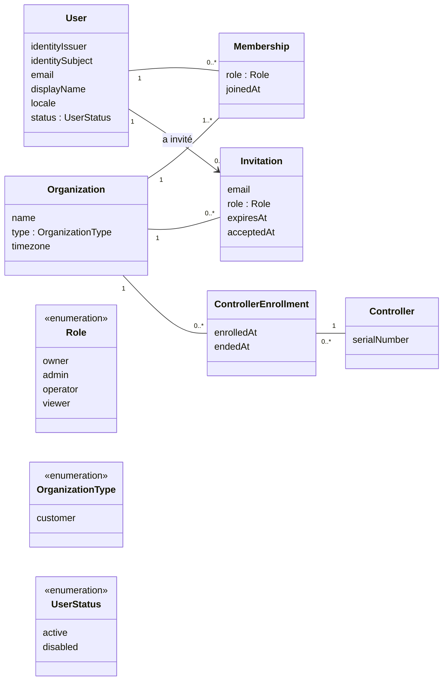

# Comptes : utilisateurs, organisations, rôles

Voir [`README.md`](README.md) pour le glossaire et les conventions.

**État** : première version, 29 septembre 2026. Le rattachement des
contrôleurs à une organisation est **acté** ; le reste est une
**proposition**.

## Diagramme

`Controller` et `ControllerEnrollment` sont détaillés dans
[`controleurs.md`](controleurs.md). Une organisation peut avoir plusieurs
contrôleurs (décision du 29 septembre 2026), chacun par un enrollment.

## Entités

### `User`
Une personne qui se connecte à l'application web. Un utilisateur peut être
membre de **plusieurs** organisations (par exemple sa propre exploitation et
celle d'un proche qu'il aide), et de zéro juste après son inscription.

- `email` : adresse vérifiée par le fournisseur d'identité, recopiée pour les
  notifications (enrollment, transfert, abonnement).
- `locale` : langue de l'interface et des notifications.
- `status = disabled` : compte bloqué sans supprimer son historique (actions
  passées, audit).
- **Authentification déléguée à un fournisseur OpenID Connect**
  (proposition) : inscription, vérification du mail, MFA, mot de passe
  oublié, connexion Google/Apple. L'utilisateur est identifié par le couple
  **(`identityIssuer`, `identitySubject`)**, c'est-à-dire l'émetteur du
  jeton (`iss`) et l'identifiant de l'utilisateur chez lui (`sub`), unique
  ensemble. Le `sub` seul ne suffit pas : deux fournisseurs peuvent émettre
  le même, par exemple lors d'un changement de fournisseur. **Aucun mot de
  passe utilisateur n'est stocké** dans notre base. Voir « Fournisseur
  d'identité » ci-dessous.
- Un utilisateur peut exister **sans abonnement** : l'inscription au cloud
  et l'abonnement sont distincts (voir `facturation.md`).

### `Organization`
Le client, propriétaire des contrôleurs. Une organisation existe même avec
un seul membre (un particulier a son organisation personnelle) : c'est ce
qui permet d'ajouter des membres plus tard sans rien migrer.

- `type` : seulement `customer` aujourd'hui (vente directe). La valeur
  `partner` est réservée aux évolutions installateur / revendeur (voir
  `README.md`).
- `timezone` : les scénarios d'arrosage et les graphes s'expriment en heure
  locale ; un contrôleur hérite du fuseau de son organisation sauf
  indication contraire (à confirmer avec `installation.md`).

### `Membership`
Lien utilisateur ↔ organisation, porteur du rôle. Un utilisateur a au plus
une adhésion par organisation.

### `Invitation`
Pour ajouter un membre à une organisation par email, y compris quelqu'un
qui n'a pas encore de compte. Devient une `Membership` à l'acceptation ;
expire sinon.

## Rôles proposés

| Rôle | Voir mesures et état | Piloter (lancer/arrêter un arrosage) | Configurer (zones, scénarios) | Gérer membres et contrôleurs | Supprimer l'organisation, facturation |
|---|---|---|---|---|---|
| `viewer` | ✅ | | | | |
| `operator` | ✅ | ✅ | | | |
| `admin` | ✅ | ✅ | ✅ | ✅ | |
| `owner` | ✅ | ✅ | ✅ | ✅ | ✅ |

Règles :
- Une organisation a **toujours au moins un `owner`** : le dernier ne peut ni
  partir ni être rétrogradé.
- Les rôles sont **par organisation**, pas par contrôleur, dans cette
  version. Des droits par contrôleur ou par zone (un salarié qui ne voit que
  sa serre) sont possibles plus tard, en ajoutant une portée à
  `Membership`.

## Règle d'accès

> Un utilisateur a accès à un contrôleur si et seulement s'il est membre de
> l'organisation qui en a l'**enrollment actif** ; ce qu'il peut faire
> dépend de son rôle. Pour l'historique, il n'accède qu'aux données
> produites pendant les enrollments de ses organisations.

L'accès aux fonctions cloud dépend aussi de l'abonnement de l'organisation
(`facturation.md`) ; jamais le fonctionnement local ni les mises à jour.

À implémenter dans **un seul service** de l'API, et non dispersée dans les
requêtes : c'est ce qui permettra d'ajouter plus tard les délégations
(`AccessGrant`) en ne modifiant qu'un endroit.

## Fournisseur d'identité (proposition, 29 septembre 2026)

L'API ne connaît **qu'un seul serveur d'identité OIDC**, qui propose
lui-même les différentes méthodes de connexion (fédération). Elle vérifie
les jetons en **OIDC standard** (clés publiques JWKS du serveur), sans SDK
propre à un fournisseur, pour que le serveur reste **remplaçable**.

Méthodes de connexion envisagées, activées dans le serveur d'identité sans
toucher à l'API :

| Méthode | Quand |
|---|---|
| Email + mot de passe, avec MFA (TOTP) | dès le départ |
| Passkeys | dès le départ |
| Google | dès le départ |
| Apple | avec une éventuelle app iOS (exigé par Apple dès qu'une app propose une autre connexion tierce) |
| Microsoft | si demande de clients professionnels |

Serveurs d'identité envisagés :

| Option | Hébergement | Remarques |
|---|---|---|
| **Zitadel** (piste privilégiée) | géré (Zitadel Cloud, région UE) ou auto-hébergé | léger, MFA, passkeys, fédération, notion d'organisations intégrée ; stocke ses données dans PostgreSQL ; même produit en géré et auto-hébergé, donc migration possible |
| Keycloak | auto-hébergé, ou géré en France (Cloud-IAM) | référence du marché, très complet, mais lourd (Java, ~1 Go de RAM) |
| Authentik | auto-hébergé | complet, plutôt orienté SSO d'entreprise |
| Auth0, Clerk | géré, hors UE par défaut | simples, mais tarif par utilisateur actif et hébergement hors UE (RGPD) |

Piste : **Zitadel Cloud en région UE** au départ. L'authentification est un
service critique (sans elle, personne ne se connecte) et le géré évite de
l'opérer sur un VPS unique ; retour possible en auto-hébergé plus tard.

Questions ouvertes :
- Zitadel Cloud ou auto-hébergé, ou un autre serveur ?
- Méthodes de connexion activées au lancement.
- Organisations : gérées dans notre base (modèle ci-dessus) ou aussi dans
  le serveur d'identité ? Proposition : **dans notre base uniquement**, le
  serveur d'identité ne gérant que l'identité des personnes ; on garde ainsi
  la liberté d'en changer.
