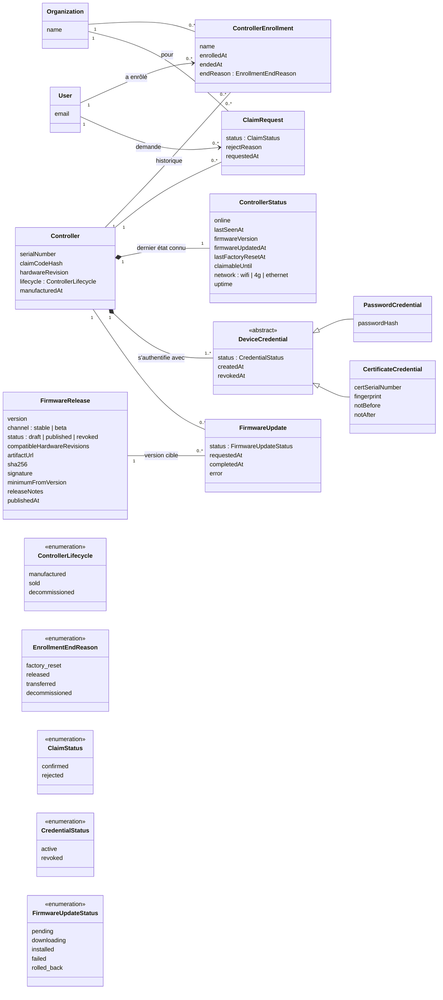

# Contrôleurs : identité, enrollment, identifiants MQTT, firmware

Voir [`README.md`](README.md) pour le glossaire et les décisions.

**État** : première version, 29 septembre 2026. Les règles métier (vente,
revente, enrollment par reset usine puis revendication, OTA gratuite, date
de mise à jour) sont **actées** ; la forme exacte des entités est une
**proposition**.

## Diagramme



La vente (`Sale`) et l'abonnement sont dans [`facturation.md`](facturation.md).

## Entités

### `Controller`
Un Moscata Modulo. Son identité est **stable pendant toute sa vie**,
indépendante de son propriétaire et de la façon dont il s'authentifie.

- `serialNumber` : identifiant unique inscrit physiquement sur le boîtier,
  qui **fait foi**. Proposition : c'est aussi le `controllerId` MQTT
  (topics, nom d'utilisateur, ACL). Il n'est **pas secret** : c'est le code
  de revendication qui protège le rattachement. Immuable, sans `/`, `+` ni
  `#`.
- `claimCodeHash` : hash du code de revendication imprimé sous le couvercle.
  Comme un mot de passe, le code n'est jamais stocké en clair.
- `hardwareRevision` : révision de la carte ; détermine les firmwares
  compatibles.
- Pas de propriétaire direct : le rattachement passe par
  `ControllerEnrollment`.

Cycle de vie physique et commercial, indépendant du cloud :

```
manufactured ──(vente neuve, facture)──▶ sold ──▶ decommissioned
```

- `manufactured` : enregistré en base au poste de flash (voir
  « Fabrication »), pas encore vendu.
- `sold` : vendu (voir `Sale`). Reste `sold` en cas de revente d'occasion :
  la revente ne passe pas par Moscata, elle se traduit seulement par un
  nouvel enrollment.
- `decommissioned` : détruit ou retiré définitivement ; identifiants
  révoqués, plus aucune revendication possible.

### `ControllerEnrollment`
Une **période** pendant laquelle un contrôleur est rattaché à une
organisation dans le cloud. Un contrôleur a **au plus un enrollment actif**
(`endedAt` vide) et garde l'historique des précédents.

- `name` : nom donné par l'organisation (« Serre nord »). Porté par
  l'enrollment et non par le contrôleur : il ne suit pas le boîtier chez le
  propriétaire suivant.
- `endReason` :
  - `factory_reset` : le contrôleur a signalé un reset usine (voir
    ci-dessous) ;
  - `released` : l'organisation a détaché le contrôleur elle-même (par
    exemple avant de le revendre) ;
  - `transferred` : clôturé automatiquement parce qu'une autre organisation
    l'a revendiqué avec succès ;
  - `decommissioned` : contrôleur retiré.
- Un contrôleur **sans enrollment actif fonctionne normalement** en local ;
  il n'a simplement pas de cloud. Il peut rester connecté au broker pour les
  mises à jour OTA.

**Cloisonnement des données (proposition)** : tout ce qui est produit pendant
un enrollment (mesures, événements, commandes, zones, scénarios configurés
dans le cloud) appartient à **l'organisation de cet enrollment**. Un nouveau
propriétaire ne voit rien de ce qui précède son enrollment ; l'ancien garde
l'accès en lecture à son historique (au moins pour l'exporter), selon la
politique de rétention. Conséquence pour `mesures.md` : les requêtes
filtrent par organisation **et** par période d'enrollment, pas seulement
par contrôleur.

### `ClaimRequest`
Une tentative de revendication d'un contrôleur par une organisation,
acceptée ou refusée. Conservée pour l'audit et pour limiter les essais.

**Principe (décision du 29 septembre 2026) : reset usine, puis rattachement.**
La preuve de possession physique est le **reset usine** lui-même (appui
long sur le bouton, déjà prévu) : un contrôleur ne peut être revendiqué que
pendant une **fenêtre** qui suit un reset usine (ou sa toute première mise
en service, un contrôleur neuf étant dans l'état usine).

Déroulé :

1. Le propriétaire fait un **reset usine** du contrôleur. Pour un contrôleur
   d'occasion, c'est de toute façon nécessaire : le reset efface la
   configuration locale de l'ancien propriétaire (Wi-Fi, etc.).
2. Il reconfigure l'accès réseau si besoin (Wi-Fi ; en 4G, rien à faire).
   À sa **première connexion au broker après le reset**, le contrôleur
   publie un événement `factory.reset` ; l'API ouvre la fenêtre de
   revendication (`ControllerStatus.claimableUntil`, durée à définir, par
   exemple 30 minutes).
3. L'utilisateur, connecté (compte vérifié par mail, MFA selon le
   fournisseur d'identité), scanne le **QR code sous le couvercle** ou saisit
   le numéro de série et le code de revendication, et choisit
   l'organisation cible (il doit y être `admin` ou `owner`).
4. L'API accepte (`confirmed`) seulement si le code est bon **et** que la
   fenêtre est ouverte ; sinon `rejected`, avec la raison (code invalide,
   pas de reset récent, trop d'essais). À l'acceptation, elle ferme la
   fenêtre, clôture l'éventuel enrollment actif d'une autre organisation
   (`transferred`) et en ouvre un nouveau.
5. Notifications par mail : confirmation au nouveau propriétaire ; **à
   l'ancienne organisation**, information que le contrôleur a été rattaché
   ailleurs.

Pourquoi c'est sûr : le code imprimé seul ne suffit pas. Un **ancien
propriétaire**, qui connaît ce code, ne peut pas revendiquer à nouveau un
contrôleur qu'il a revendu, faute de pouvoir le réinitialiser.

**Le reset usine est irréversible et clôt l'enrollment** (décision du
29 septembre 2026). Il se fait physiquement sur le contrôleur, qui revient
à l'état neuf : aucun retour en arrière possible depuis le Moscata. Même
sans revente, le propriétaire doit **réenrôler** le contrôleur comme s'il
venait de l'acheter. À la réception de `factory.reset`, l'API :

- clôture l'enrollment actif (`endReason = factory_reset`) ;
- efface la configuration retained (publication d'un `config` vide,
  retained), sinon le broker la redélivrerait au contrôleur réinitialisé ;
- ouvre la fenêtre de revendication.

Un réenrollment par la **même organisation** crée un **nouvel**
enrollment ; elle garde l'accès à son historique, puisque les deux
enrollments sont les siens. Seule une organisation **abonnée** peut
restaurer une **sauvegarde de configuration** conservée dans le cloud (à
modéliser avec la configuration dans `installation.md`) ; la restauration
est une action explicite, jamais automatique.

**Côté firmware** : la première connexion au broker après un reset doit se
faire en **session propre** (clean start). Sinon, le broker délivrerait les
messages QoS 1 mis en file pour la session précédente (commandes de
l'ancien propriétaire). Les commandes portent aussi une date d'expiration
(`expiresAt`), mais le reset ne doit pas dépendre de cette seule
protection.

**Décalage accepté** (décision du 29 septembre 2026) : un reset fait hors
ligne n'est connu du cloud qu'à la reconnexion suivante, qui peut ne jamais
arriver, puisque le Moscata reste pleinement opérationnel sans cloud.
D'ici là, l'enrollment reste affiché comme actif. L'interface montre la
date du dernier contact (`ControllerStatus.lastSeenAt`), et l'organisation
peut détacher le contrôleur elle-même (`released`). Le firmware doit
mémoriser le reset jusqu'à la prochaine connexion au broker, pour que le
signal ne soit pas perdu.

Risque résiduel : un ancien propriétaire qui connaît le code pourrait
tenter de revendiquer pendant la fenêtre ouverte par le nouveau
propriétaire. Il faudrait qu'il sache à quel moment le reset a eu lieu ; le
nouveau propriétaire verrait l'échec et l'ancien serait identifié
(`ClaimRequest`, notification). Fenêtre courte et nombre d'essais limité
réduisent ce risque.

### `ControllerStatus`
Le **dernier état connu** du contrôleur, mis à jour par l'API à partir du
topic `status` (retained, avec Last Will) de
[`../MQTT-Topics.md`](../MQTT-Topics.md). Ce n'est pas un historique :
l'historique des connexions relève de `mesures.md` (événements).

- `firmwareVersion` : version **déclarée par le contrôleur**. C'est elle qui
  fait foi, y compris après un retour arrière automatique suite à une mise à
  jour ratée.
- `firmwareUpdatedAt` : **date de mise à jour** du firmware actuel (décision
  du 29 septembre 2026), c'est-à-dire la date à laquelle cette version a été
  constatée pour la première fois sur ce contrôleur. Déduite par l'API d'un
  changement de `firmwareVersion` : elle couvre donc aussi un flash manuel
  hors OTA, et correspond à `FirmwareUpdate.completedAt` pour une mise à jour
  OTA.
- `lastSeenAt` : dernier message reçu de ce contrôleur, quel que soit le
  topic.
- `lastFactoryResetAt`, `claimableUntil` : date du dernier reset usine
  signalé (événement `factory.reset`) et fin de la fenêtre de revendication
  qu'il ouvre (voir `ClaimRequest`).

### `DeviceCredential`
Ce qui permet au contrôleur de s'authentifier auprès du broker. Séparé de
`Controller` pour que le mode d'authentification puisse évoluer sans
toucher à l'identité. **Indépendant du propriétaire** : un changement de
propriétaire ne change pas les identifiants MQTT, qui n'ont jamais été
connus du client.

- **Plusieurs identifiants par contrôleur** : nécessaire pour la rotation
  sans coupure (le nouveau est créé, envoyé au contrôleur, utilisé, puis
  l'ancien est révoqué).
- `PasswordCredential` : **seul mode implémenté aujourd'hui** (état actuel
  du broker). Seul le hash est stocké.
- `CertificateCredential` : **non implémenté**, présent pour montrer que le
  mTLS s'ajoute sans restructuration. Avec le mTLS, le certificat porte le
  `controllerId` (CN) et Mosquitto l'utilise comme nom d'utilisateur
  (`use_identity_as_username`) : topics et ACL restent inchangés.
- Migration possible d'un parc déjà installé du mot de passe vers le mTLS :
  mise à jour OTA, génération de la clé dans le contrôleur, demande de
  certificat envoyée via la session authentifiée par mot de passe,
  signature par l'API, puis révocation du mot de passe.

Hors de ce modèle (infrastructure) : le certificat TLS du broker
(Let's Encrypt, sur le VPS) et, en cas de mTLS, la CA privée et sa liste de
révocation.

### `FirmwareRelease`
Une version publiée du firmware.

- `version` : semver, unique par canal.
- `compatibleHardwareRevisions` : une version n'est proposée qu'aux
  contrôleurs de révision matérielle compatible.
- `artifactUrl`, `sha256`, `signature` : le **binaire n'est pas en base**,
  il est dans un stockage objet ; la base garde l'emplacement, l'empreinte
  et la signature, vérifiées par le contrôleur avant installation.
- `minimumFromVersion` : si une mise à jour exige de passer par une version
  intermédiaire.
- `status = revoked` : version retirée (bug), plus jamais proposée.
- La CA racine de confiance du broker (ISRG Root X1 aujourd'hui) est
  embarquée dans le firmware : un changement de CA passera par une
  `FirmwareRelease`.

### `FirmwareUpdate`
Une tentative de mise à jour OTA d'un contrôleur vers une version.

- **Gratuite et indépendante de l'abonnement** (décision du 29 septembre
  2026) : proposée à tout contrôleur joignable, enrollé ou non.
- Permet les déploiements progressifs (une fraction du parc d'abord) et de
  repérer les contrôleurs bloqués.
- `rolled_back` : la nouvelle version n'a pas démarré correctement et le
  contrôleur est revenu à l'ancienne (rollback d'ESP-IDF). Le cloud le
  constate quand `ControllerStatus.firmwareVersion` revient à l'ancienne
  version à la reconnexion.
- Côté MQTT, nécessite une commande `firmware.update`, absente du contrat
  actuel.

## Fabrication (proposition)

Assemblage et flash en France, cartes fabriquées en Chine : les secrets ne
transitent pas par l'usine. Au poste de flash, pour chaque contrôleur :

1. générer le numéro de série et le code de revendication (aléatoire,
   imprimable, sans caractères ambigus comme `0`/`O`, `1`/`l`) ;
2. flasher le firmware, le numéro de série et les premiers identifiants
   MQTT ;
3. enregistrer le contrôleur en base (`manufactured`, `claimCodeHash`,
   `PasswordCredential`) via un outil authentifié de l'API ;
4. imprimer les étiquettes :
   - **à l'extérieur** : numéro de série seul (support sans ouvrir) ;
   - **sous le couvercle** : numéro de série, code de revendication et QR
     code (lien vers la page d'enrollment, pré-rempli).

C'est ce registre qui permet de dire que tous les contrôleurs en circulation
sont connus.

## Points ouverts propres à ce fichier

- Format du numéro de série (longueur, préfixe, somme de contrôle pour
  détecter les fautes de saisie).
- Durée de la fenêtre de revendication après un reset usine.
- Le contrôleur doit mémoriser qu'un reset a eu lieu jusqu'à sa prochaine
  connexion au broker (il peut rester hors ligne longtemps, le temps de
  reconfigurer le Wi-Fi) : à prévoir dans le firmware.
- Configuration du Wi-Fi après un reset (BLE, point d'accès temporaire…) :
  relève du firmware, mais conditionne l'expérience d'enrollment.
- Mises à jour : automatiques par canal, ou déclenchées (par Moscata, par le
  client) ? Fenêtre horaire (jamais pendant un arrosage) ?
