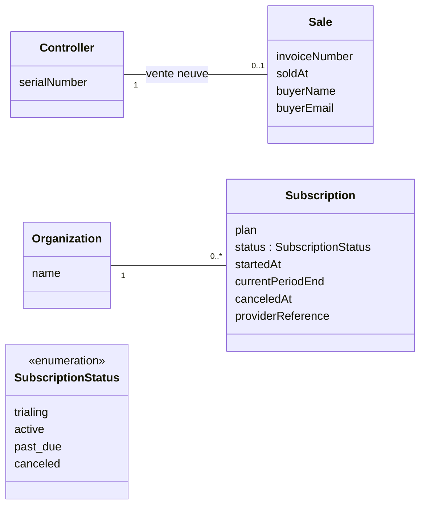

# Facturation : vente des contrôleurs, abonnement cloud

Voir [`README.md`](README.md) pour le glossaire et les décisions.

**État** : ébauche, 29 septembre 2026. Les règles métier sont **actées** ;
les entités et les attributs sont une **proposition**, beaucoup de points
restent ouverts.

## Deux flux indépendants

| | Vente d'un contrôleur | Abonnement cloud |
|---|---|---|
| Obligatoire | oui, à la vente neuve | non |
| Fréquence | une fois par contrôleur | mensuelle |
| Qui | l'acheteur neuf (compte cloud non nécessaire) | une organisation cloud |
| Lien avec l'autre | aucun : on peut acheter sans s'abonner, s'abonner plus tard, ou s'abonner avec un contrôleur d'occasion | |

## Diagramme

## Entités

### `Sale`
La vente neuve d'un contrôleur par Moscata. **Une facture par contrôleur**
(décision du 29 septembre 2026).

- `0..1` côté contrôleur : un contrôleur `manufactured` n'est pas encore
  vendu.
- L'acheteur n'a **pas besoin de compte cloud** : `buyerName` et
  `buyerEmail` identifient l'acheteur pour la facture et le support, sans
  lien obligatoire vers un `User`. Données personnelles : durée de
  conservation à définir (obligations comptables).
- La revente d'occasion ne passe pas par Moscata et ne crée **pas** de
  `Sale` : elle apparaît seulement comme un nouvel enrollment (voir
  `controleurs.md`).

### `Subscription`
L'abonnement mensuel au cloud d'une organisation.

- `providerReference` : identifiant chez le prestataire de paiement
  (Stripe ou autre, à choisir). Le paiement récurrent, les moyens de paiement
  et les factures d'abonnement sont délégués à ce prestataire ; la base ne
  garde que l'état nécessaire pour ouvrir ou fermer l'accès au cloud.
- N'influence **ni le fonctionnement local ni les mises à jour OTA**
  (décisions du 29 septembre 2026).

## Questions ouvertes

- **Périmètre de l'abonnement** : par organisation (forfait) ou par
  contrôleur (quantité) ? Dans le second cas, lien `Subscription` →
  contrôleurs couverts.
- **Factures de vente** : émises par ce système ou par un outil de
  facturation séparé, dont on ne garderait que `invoiceNumber` ?
- **Fin d'abonnement** : que devient l'accès aux données, et combien de
  temps sont-elles conservées ?
- **Période d'essai** incluse à l'achat d'un contrôleur neuf ?
